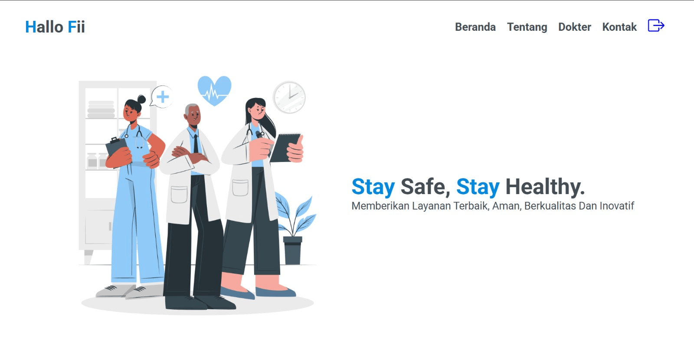

# 📘 Final Project RPL-Sistem Website Reservasi Layanan Klinik

## 👨‍💻 Nama kelompok & anggota

| No |     Nama Anggota     |                             NIM / Jobdesk                            |
| -- | -------------------- | -------------------------------------------------------------------- |
| 1. | M. Treza Nurrohman   | 701230105 (Desain UI/UX, implementasi design, deployment kehosting)  |
| 2. | M. Farih Ihsan Rosi  | 701230109 (Requirement gathering, implementasi design, menyusun SRS) |
| 3. | Hapni                | 701230305 (Pembuatan PPT, testing website, desain UML/diagram )      |

## 📝 Deskripsi Singkat Aplikasi

Sistem ini dibuat berdasarkan permintaan dari klien (kelompok 8)

HalloFii adalah sebuah aplikasi layanan kesehatan dan konsultasi klinik berbasis web yang dirancang untuk memfasilitasi pasien dalam mengakses layanan kesehatan secara lebih cepat tanpa antri, selain itu cakupan untuk aplikasi ini ditujukan untuk masyarakat disekitar wilayah klinik

## 🎯 Tujuan Sistem / Permasalahan yang Diselesaikan

Website ini dirancang untuk memberikan kemudahan akses bagi pengguna dalam melakukan registrasi akun, login, melakukan pemesanan jadwal kunjungan ke klinik. Sistem ini mencakup fitur utama berupa registrasi dan login akun pengguna, pemesanan jadwal kunjungan klinik secara terjadwal. Selain itu, aplikasi ini juga dilengkapi dengan manajemen pengguna, dimana admin memiliki hak untuk mengelola data pasien dan dokter, serta menghasilkan laporan mengenai aktivitas sistem.

## 🛠️ Teknologi yang Digunakan (framework, database, bahasa pemrograman)

    - 🐘 PHP
    PHP digunakan sebagai bahasa pemrograman server-side untuk mengelola seluruh proses bisnis aplikasi. Pada sistem HalloFii, PHP menangani:
        •	Proses registrasi & login
        •	Pengelolaan data dokter
        •	Pengolahan data pasien
        •	Pembuatan & pengelolaan reservasi
        •	Validasi dan pengolahan data dari pengguna maupun admin
    PHP dipilih karena mudah digunakan, ringan, serta terintegrasi dengan baik bersama MySQL.

    - ⚡ JavaScript
    JavaScript berperan pada sisi client-side untuk membuat tampilan lebih interaktif. Pada sistem HalloFii, JavaScript digunakan untuk:
        •	Menampilkan peringatan ketika form belum lengkap
        •	Mengatur dropdown atau jadwal dokter
        •	Membuat halaman lebih responsif saat user berinteraksi
    Keberadaannya menjadikan pengalaman pengguna lebih dinamis dan nyaman.

    - 🎨 CSS (Cascading Style Sheets)
    CSS digunakan untuk mengatur tampilan visual website, meliputi:
        •	Warna, ukuran teks, layout, dan posisi elemen
        •	Tampilan form reservasi
        •	Navigasi dan tabel pada halaman admin/pasien
    Dengan CSS, tampilan menjadi rapi, konsisten, modern, dan mudah dipahami.

    - 🟦 Bootstrap 5
    Bootstrap 5 digunakan sebagai framework untuk mempercepat pembuatan antarmuka. Fitur yang dimanfaatkan pada sistem HalloFii meliputi:
        •	Grid layout
        •	Navbar responsif
        •	Tabel & form
        •	Button, card, dan komponen siap pakai lainnya
    Bootstrap memastikan website tampil responsif dan nyaman digunakan di berbagai perangkat, seperti laptop, tablet, dan smartphone.

    - 🗄️ MySQL (Database Management System)
    MySQL digunakan sebagai sistem basis data untuk menyimpan seluruh informasi penting seperti:
        •	Data user
        •	Data dokter
        •	Data pasien
        •	Data reservasi
    Database MySQL mendukung:
        •	Relasi antar tabel (mengacu pada ERD)
        •	Query kompleks
        •	Foreign key & indexing
    Hal ini menjadikan penyimpanan data lebih cepat, aman, dan terorganisir.

## 🚀 Cara Menjalankan Aplikasi

    Cara instalasi & menjalankan sistem (run project):

    1. unduh atau clone project PHP yang ingin digunakan, kemudian letakkan folder project tersebut di direktori web server. Jika Anda menggunakan XAMPP, project dimasukkan ke dalam folder htdocs, sedangkan jika menggunakan Laragon atau WAMP, letakkan di folder www.
    2. Buka phpMyAdmin melalui browser dan buat sebuah database baru. Setelah database dibuat, impor file SQL yang disertakan dalam project—biasanya bernama database.sql—untuk menghasilkan tabel dan data awal yang diperlukan.
    3. Langkah berikutnya adalah melakukan konfigurasi koneksi database. Pada project PHP biasanya terdapat file konfigurasi seperti config.php, koneksi.php, atau db.php. Buka file tersebut kemudian sesuaikan informasi koneksinya dengan environment yang digunakan, seperti nama host (umumnya localhost), username (biasanya root), password, dan nama database yang sudah dibuat sebelumnya.
    4. Jika konfigurasi sudah benar, jalankan Apache dan MySQL melalui XAMPP/Laragon, lalu akses project melalui browser dengan membuka alamat http://localhost/nama-folder-project. Jika semua langkah dilakukan dengan benar, aplikasi akan berjalan tanpa masalah.

## 🔐 Akun Demo (jika ada login):

    - 🛡️ Login Admin
    • username: admin
    • password: 22

    - 👤 Login User
    • username: pasien
    • password: 22

## 🔗 Link Deployment / Link APK / Link Demo Video

https://hallofii.gt.tc/

## 🖥️ Screenshot Halaman Utama (opsional tapi bagus)

## 💡 Catatan Tambahan

    Hal-hal penting yang perlu diketahui, misalnya:
        - keterbatasan sistem
        Aplikasi ini memiliki fitur registrasi dan login serta form pengisian data untuk memilih dan mengkonfirmasi reservasi layanan klinik. Aplikasi ini dibuat dengan menggunakan bahasa pemrograman PHP. Aplikasi ini menggunakan database MySQL untuk menyimpan semua data.

## 📋 Keterangan tugas

Project ini ditujukan untuk memenuhi tugas Final Project mata kuliah Rekayasa Perangkat Lunak (RPL) pada Semester 5 dengan dosen pengampu: Dila Nurlaila, M.Kom.
